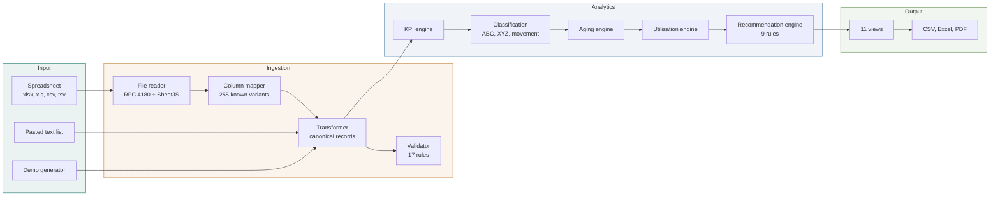

# Documentation

Start here.

## Reading order

If you are **new to the project**, read in this order:

1. [Architecture](architecture.md): what the pieces are and how data moves between them
2. [Data model](data-model.md): what a record looks like once it is inside
3. [Metrics](metrics.md): how each number on screen is produced

If you are **changing the code**:

4. [Development](development.md): setup, conventions, how to add a page or a metric
5. [Design system](design-system.md): tokens and component vocabulary
6. [Accessibility](accessibility.md): the standard the interface is held to

If you are **deploying it**:

7. [Deployment](deployment.md): GitHub Pages, self-hosting, air-gapped installs

## Presenting or teaching from this

[docs/presentation](presentation/) holds a slide deck covering the problem, the approach, the architecture and the results, plus speaker notes.

## The shape of the system in one diagram

Nothing in this diagram crosses a network boundary. Every box runs in the browser tab.

## Quick facts

|                                 |                                                |
| ------------------------------- | ---------------------------------------------- |
| Modules                         | 40 JavaScript files, 5 stylesheets             |
| Source size                     | 15,318 lines of JavaScript and CSS             |
| Build step                      | None                                           |
| Runtime dependencies            | Chart.js. Three more load only when you export |
| Views                           | 11                                             |
| Column name variants recognised | 255 across 11 target fields                    |
| Data quality rules              | 17                                             |
| Recommendation rules            | 9                                              |
| Reference SKUs                  | 30, each with 12 months of synthetic sales     |
| Lowest colour contrast ratio    | 4.82:1 against a 4.5:1 requirement             |

Every figure above is counted from the source by `scripts/` checks or by direct inspection, not estimated.
