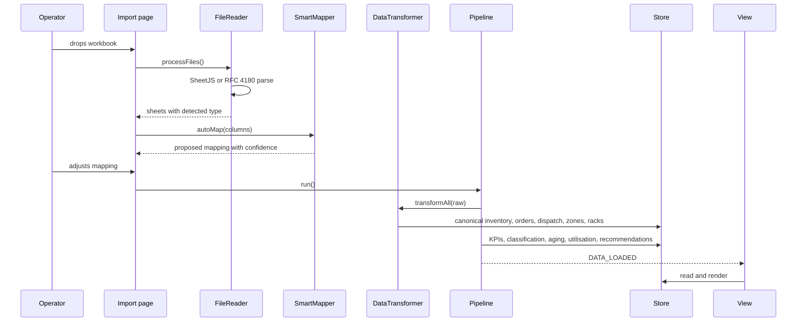
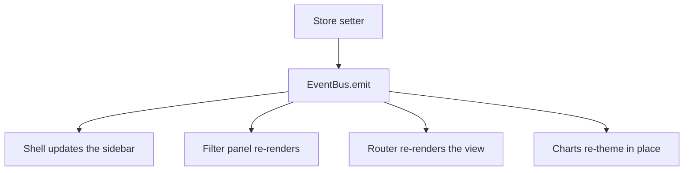

# Architecture

[Documentation index](README.md)

## The constraint that shapes everything

Depot stock data cannot leave the building. That single constraint rules out a
server, which rules out a database, which rules out most of what a analytics
product would normally be.

What remains is a static page that does all its work in the tab. Every design
decision below follows from that.

## Layout

```
index.html              Script order and the empty shell
assets/css/             Five layers, loaded in cascade order
  01-tokens.css           Colour, type, space, motion. No rules, only values
  02-base.css             Reset, typography, focus, print
  03-layout.css           App shell and every responsive breakpoint
  04-components.css       Buttons, fields, tables, panels, states
  05-pages.css            Styles specific to one view
src/
  core/                 Namespace, events, state, theme, routing
  lib/                  Pure helpers with no DOM or state dependency
  ui/                   Rendering: icons, charts, components, shell, export
  data/                 Reference dataset and the demo generator
  ingestion/            Reading, mapping, validating, normalising
  analytics/            The five engines and the pipeline that runs them
  filters/              Global filter state and the per-dataset field maps
  pages/                One file per view
  main.js               Bootstrap, loads last
scripts/                Verification run in CI
docs/                   This
```

The split between `lib/` and `ui/` is load bearing. Anything in `lib/` is a
pure function of its arguments: it can be reasoned about, and tested, without a
browser. Anything in `ui/` touches the DOM.

## Module system

There is none. Every file is an immediately invoked function that hangs itself
off a single `window.GovSpirit` global, and `index.html` lists them in
dependency order.

This is a deliberate choice, not an oversight. ES modules do not load from
`file://` because of the origin rules, so switching to them would break the
"copy the folder onto a shared drive and open it" case that the depot audience
actually needs. Forty script tags over HTTP/2 costs very little, and the
project ships no bundler for anyone to maintain.

The cost of the approach is load-order fragility. That is contained by
`GovSpirit.require()`, which fails loudly at definition time:

```js
const { Store, Format } = GovSpirit.require('Store', 'Format');
// Throws: "[GovSpirit] Missing dependencies: Format. Check the script order."
```

Without it, a mis-ordered script produces `undefined` and the failure surfaces
three calls later somewhere unrelated.

## Data flow



Every entry point converges on `Pipeline.run()`. Before this existed, the
upload flow, the paste flow and the demo loader each listed the engines by
hand, and one of them was already missing a step.

## State

One store. Reads return a frozen shallow copy, so the top level cannot be
reassigned from outside, while nested collections are shared by reference
because copying tens of thousands of inventory rows on every read would be
absurd.

Writes go through named setters, each of which emits the relevant event.
Nothing polls.



## Rendering

Views are strings. A page module exposes `render()`, which returns markup, and
`mount()`, which binds behaviour and draws charts after the browser has laid
the container out.

Markup is built with a tagged template that escapes every interpolation:

```js
html`<td>${row.brand}</td>`; // escaped, always
html`<tbody>
  ${raw(rowsMarkup)}
</tbody>`; // trusted, and visible in review
```

This is the security boundary. Cell values, column headings and file names all
originate in a file somebody else sent the operator. Before this change they
went into `innerHTML` unescaped, so a cell containing
`` executed the moment it was previewed.

`raw()` appears at eight call sites across the codebase. Every one emits
markup this code produced itself: `selected` and `aria-disabled` attribute
flags, one placeholder table cell, and the icon and brand mark renderers. None
of them touches operator data. That is a short enough list to audit by hand,
which is the point of making the escape hatch explicit.

## Charts

Chart.js reads its colours from CSS custom properties rather than from literals
at each call site. That gives three things:

- Light mode works. Previously every chart hard-coded dark hexes, so light mode
  drew dark grey axis labels on white.
- Switching theme updates live charts in place. The old build re-navigated the
  whole page, losing scroll position and view state.
- Axis density, label rotation and legend position respond to the viewport
  instead of being tuned for a desktop monitor and overflowing on a phone.

Every canvas is created with `role="img"` and a text summary, because a bitmap
chart is otherwise invisible to assistive technology.

## Routing

Hash based. `#/executive` is a real address: it can be bookmarked, shared, and
reached with the Back button. Views that need data redirect to the import
screen until a dataset is loaded.

The router owns teardown. Before replacing the DOM it calls the outgoing page's
`unmount()` and destroys every registered chart, which is what stops Chart.js
instances leaking across navigations.

## Responsive model

One breakpoint carries real weight: **1024px**.

| Width         | Sidebar                               |
| ------------- | ------------------------------------- |
| 1024px and up | Persistent rail, collapsible to icons |
| Below 1024px  | Off-canvas drawer with a scrim        |

Below 1024px the drawer is a modal surface, so it behaves like one: focus trap,
Escape to close, `inert` on the content behind it, and focus returned to the
trigger on close.

The closed drawer is also made `inert` explicitly. The stylesheet sets
`visibility: hidden`, but that value arrives through a transition, and a
transition does not settle while the tab is backgrounded. Relying on it alone
left eleven off-screen navigation buttons in the tab order.

Smaller breakpoints at 900px, 640px and 400px adjust density rather than
structure. A 320px screen is a supported target and is checked on every view.

## Deliberate limits

- **No build step.** Costs minification and tree shaking. Buys a folder that
  still opens in five years without a toolchain.
- **No framework.** Costs the ecosystem. Buys 15,000 readable lines with no
  upgrade treadmill and no dependency surface beyond the charting library.
- **No tests yet.** The verification that exists is real (lint, formatting,
  contrast, stylesheet coverage) but it is not unit tests. `lib/` was separated
  from `ui/` precisely so that adding them is straightforward. See
  [ROADMAP](../ROADMAP.md).
- **Client-side memory bound.** Files above 60 MB are refused, and sheets are
  capped at 200,000 rows, because past that the tab becomes unusable and a
  refusal is better than a hang.
