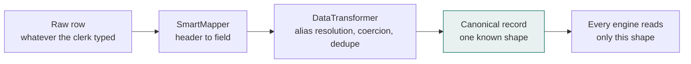

# Data model

[Documentation index](README.md)

What a record looks like once it is inside the application, and how your
spreadsheet becomes one.

## The pipeline in one line

```
your file → detected type → mapped columns → cleaned record → analytics
```



Only `DataTransformer` knows about the mess. Everything downstream reads one
shape, which is why adding a metric does not mean learning eleven spellings of
"quantity".

## Recognised file types

`FileReader` scores a sheet against 12 signatures using both the file name and
the column names. The operator can override the result.

| Type              | Name hints                   | Column hints                   |
| ----------------- | ---------------------------- | ------------------------------ |
| `inventory`       | inventory, stock, closing    | qty, bin, sku                  |
| `skuMaster`       | sku, master, pricelist       | sku, brand, price              |
| `orders`          | order, hotel, indent         | order, hotel, date             |
| `dispatch`        | dispatch, challan, delivery  | dispatch, vehicle, date        |
| `warehouseLayout` | layout, godown, bin_master   | zone, rack, capacity           |
| `goodsReceipt`    | grn, receipt, inbound        | receipt, supplier, date        |
| `stockMovement`   | movement, transfer           | from, to, reason               |
| `suppliers`       | supplier, vendor, distillery | supplier, contact              |
| `employees`       | employee, roster, staff      | employee, role, shift          |
| `damage`          | damage, breakage             | damaged, cause, qty            |
| `cycleCount`      | cycle_count, stocktake       | physical, variance, system_qty |
| `returns`         | return, reversal             | returned, reason, qty          |

## Column mapping

Eleven target fields, 255 known variants. Scoring runs in four tiers so an
exact match always beats a fuzzy one:

| Score      | Condition                           |
| ---------- | ----------------------------------- |
| 1.00       | Exact match after normalisation     |
| 0.85       | One string is a prefix of the other |
| 0.70       | One string contains the other       |
| up to 0.55 | Levenshtein similarity above 0.62   |

Below 0.25 the column is left unmapped. At or above 0.55 the mapping is applied
automatically; between the two it is applied but flagged for review.

Assignment is greedy on the globally best score and each target field can only
be claimed once. A sheet carrying both `Qty` and `Closing Stock` maps the
stronger of the two and leaves the other for the operator, rather than picking
arbitrarily.

### Target fields

| Field           | Required | Example headings it recognises                            |
| --------------- | -------- | --------------------------------------------------------- |
| `brand`         | Yes      | Brand, Product, Item Description, Liquor Name, Stock Item |
| `quantity`      | Yes      | Qty, No. of Bottles, Closing Stock, Balance Qty, On Hand  |
| `size`          | No       | Size, Volume, Pack Size, Bottle Size (ml), Ltr            |
| `category`      | No       | Category, Type, Liquor Type, Product Group                |
| `zone`          | No       | Zone, Godown, Storage Area, Block, Section                |
| `rack`          | No       | Rack, Shelf, Bin, Aisle, Rack No                          |
| `price`         | No       | Price, MRP, Rate, Issue Price, Excise Price               |
| `total_value`   | No       | Total Value, Stock Value, Closing Value                   |
| `supplier`      | No       | Supplier, Vendor, Party Name, Distillery                  |
| `received_date` | No       | Date, GRN Date, Date of Receipt, Posting Date             |
| `sku_id`        | No       | SKU, Item Code, Material Code, Excise Code, Barcode       |

## Canonical inventory record

Produced by `DataTransformer.cleanInventory`.

| Field                  | Type         | Notes                                                       |
| ---------------------- | ------------ | ----------------------------------------------------------- |
| `inv_id`               | string       | Generated when absent                                       |
| `sku_id`               | string       | **Rows without one are dropped**: they cannot be reconciled |
| `sku_name`             | string       | Falls back to `sku_id`                                      |
| `brand`                | string       | Defaults to Unknown                                         |
| `category`             | string       | Defaults to Unknown                                         |
| `alcohol_type`         | string       | Falls back to category                                      |
| `bottle_size`          | string       | Normalised to millilitres where recognisable                |
| `supplier`             | string       | Defaults to Unknown                                         |
| `zone`                 | string       | Derived from the rack prefix when absent                    |
| `rack_id`              | string       | Uppercased                                                  |
| `bin_id`               | string       | Falls back to `rack_id`                                     |
| `quantity_bottles`     | number       | Clamped at zero and above                                   |
| `quantity_cases`       | number       | Derived from case size when absent                          |
| `unit_price`           | number       | Clamped at zero and above                                   |
| `total_value`          | number       | Stated value, otherwise quantity times price                |
| `last_received_date`   | Date or null |                                                             |
| `last_dispatched_date` | Date or null |                                                             |
| `days_in_stock`        | number       | Stated, otherwise derived from receipt date                 |
| `lot_number`           | string       |                                                             |
| `expiry_date`          | Date or null |                                                             |
| `condition`            | string       | Defaults to Good                                            |
| `is_active`            | Yes or No    |                                                             |

### Alias resolution

Each canonical field accepts several source spellings. `unit_price` reads any
of `unit_price`, `price_per_bottle`, `price`, `rate`, `mrp`.

This matters more than it sounds. Version 1 read only `unit_price` while one of
its own dataset builders wrote `price_per_bottle`, so every unit price silently
became zero and the entire valuation chain with it. The same mismatch existed
between `capacity` and `capacity_bottles`, and between `current_qty` and
`occupied_bottles`, in the layout data.

### De-duplication

Records are keyed on `sku_id` plus `bin_id`. The same product appearing twice
in one bin is a data-entry artefact, not two distinct holdings, so the second
occurrence is dropped and the validator reports the count.

## Date handling

Excise exports carry dates in at least four shapes. All are accepted:

| Input               | Interpretation                                  |
| ------------------- | ----------------------------------------------- |
| Excel serial number | Days since 1899-12-30, bounded to a valid range |
| `2026-03-14`        | ISO                                             |
| `20260314`          | Compact                                         |
| `14/03/2026`        | **Day first**                                   |

Day-first parsing is the important one. Native `new Date('01/02/2026')` returns
2 January, following the American convention. In India, and across the
Commonwealth, that string means 1 February. Left alone, this is a silent
one-month error on every affected record.

Where the fields are genuinely ambiguous the parser uses whichever reading is
possible: `25/03` can only be day-first, `03/25` can only be month-first, and
`03/04` is read day-first.

## Validation

Seventeen rules across four datasets. Each reports the count, the percentage,
and up to three affected spreadsheet row numbers, adjusted for the header row
so the number matches what the operator sees in Excel.

| Severity | Effect on the quality score |
| -------- | --------------------------- |
| Error    | Up to 30 points, minimum 5  |
| Warning  | Up to 10 points, minimum 2  |
| Info     | None                        |

### Rules

**Inventory**

| Rule                       | Severity |
| -------------------------- | -------- |
| Missing SKU identifier     | Error    |
| Missing quantity           | Error    |
| Negative quantity          | Error    |
| Expired stock still held   | Error    |
| Missing unit price         | Warning  |
| Missing storage location   | Warning  |
| Receipt date in the future | Warning  |
| Duplicate SKU and bin      | Warning  |
| Held longer than 365 days  | Info     |

**Orders**

| Rule                                 | Severity |
| ------------------------------------ | -------- |
| Missing customer                     | Error    |
| Missing or unreadable order date     | Error    |
| Fulfilled more than 5% above ordered | Warning  |
| Order date in the future             | Warning  |

**Dispatch**

| Rule                     | Severity |
| ------------------------ | -------- |
| Missing or zero quantity | Error    |
| Missing dispatch date    | Error    |

**Layout**

| Rule                          | Severity |
| ----------------------------- | -------- |
| Row without a zone            | Error    |
| Zero or negative bin capacity | Warning  |

## Reference dataset

Thirty SKUs with twelve months of synthetic sales, used to suggest a zone and
estimate stock cover when the operator's own file carries no history.

The figures are invented but the shape is not: nip and quarter sizes dominate
by volume, beer peaks through summer while spirits peak around Diwali and New
Year, and premium imports move in single or double digits per month.

Source: [`src/data/referenceData.js`](../src/data/referenceData.js)

## Free-text parsing

The paste tab accepts lines a storekeeper would actually type:

```
Royal Stag 180ml 200 bottles Zone A
imp blue 60ml - 500 nos rack A2
kingfisher 650 300
```

Extraction runs in order: size, then quantity, then location, then brand
against 26 alias groups, then category by keyword, then enrichment from the
reference dataset. Each line reports a confidence, and unrecognised brands are
listed as warnings rather than being quietly guessed at.
